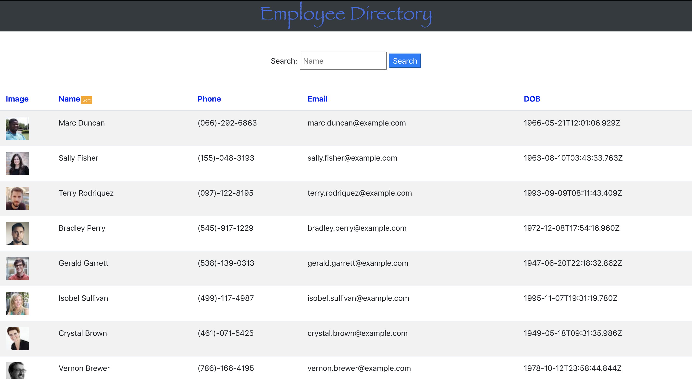
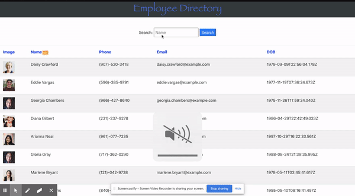

# React : Employee Directory

## Table of Contents

### Introduction
### UserStory
### Installation
### Screenshots
### GIF
### Questions

## Introductiom
  Here we have  a simple table with 4 fields of an employee's name, image , email and phone number . This application is my first attempt at using REACT. It simply layouts details of about 200 employee whom we have sorted by name. 
  There is also a search form that searhes an employee by name.

## User Story 

- As a user, I want to be able to view my entire employee directory at once so that I have quick access to their information.

## Installation
To install necessary dependencies, run the following command:
npm 
npm create-react-app

## Screenshots

Questions

If you have any questions drop by at 
